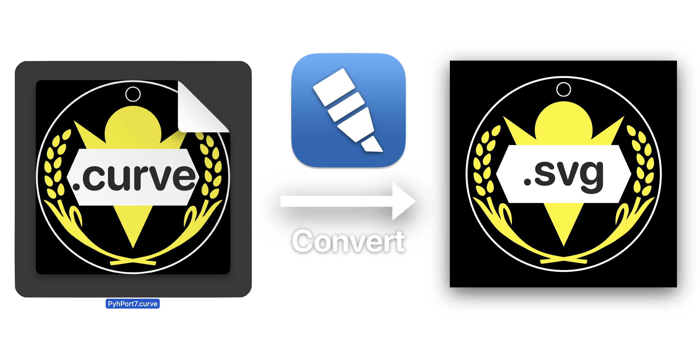

# Vectornator Inspection

## About
Vectornator Inspection aims to convert .vectornator / .curve files into SVG.

## TODO
* Complete Linearity Curve 5.x format(yes, Vectornator 4.x and Curve 5.x files are technically different format!)
* Vectornator 4.x file format support will be added later.
* group inside group and Bitmap(png) embedding.
* Blend Mode.
* Automatically uses `Pixels` as units. Curve supports other units as well, which will be added later.
* text, Curve has weired text format (base64-encoded binary plist). I made the decoder, but I haven't done anything else.
* Other stuffs(line styles, multiple artboards, masks) I'm not sure how to implement them.

Any amount of contribution is welcome!

## Motivation
Popular Illustrator alternative app Vectornator has changed its name to Linearity Curve.

Vectornator offered all of its features for free. However, with Linearity Curve, most of them have been paywalled, **INCLUDING SVG/PDF EXPORT.**

This means Curve documents cannot be exported without sacrificing quality.

All of my works on Curve can no longer be exported with layer structures intact. It is such a bummer.

So in this project, I want to make a converter for Vectornator files, so that all of my projects are safe.

And once this is working, I might make an Inkscape extension that can import such files.
